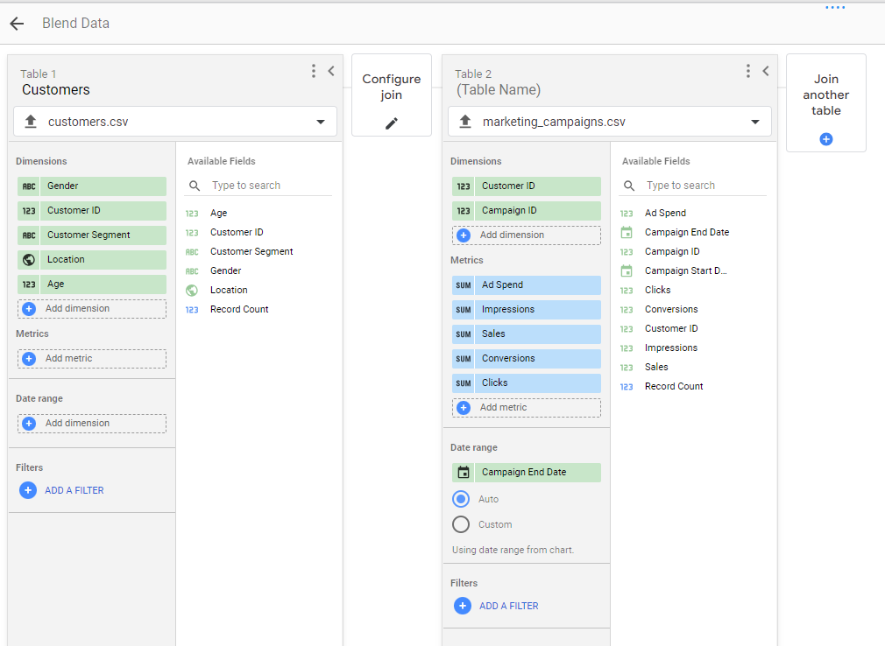

# Product-Campaign-Metrics:-Comparing-Marketing-Campaigns-against-Competitors

## Description
This project offers insights into how a consumer electronics industry leverages data analytics to Assess marketing campaign effectiveness, optimize strategies, enhance competitive positioning, and provide valuable lessons in data-driven decision-making. The Business focus is in the energy domain.

`link to report:` https://lookerstudio.google.com/s/o6EhIm_Rpf4

## Project Learning:
This case study showcases the use of data analytics to evaluate and enhance marketing strategies within the consumer electronics industry. Focused on assessing the effectiveness of marketing campaigns, the study highlights how data-driven insights can significantly optimize strategies and bolster competitive positioning. Additionally, it offers a practical demonstration of designing and implementing a relational database structure using `LOOKER(a business intelligence tool)` for data analytics, facilitating deeper analysis and better decision-making processes.

## Key learning points
- Data Blending
- Data Analysis
- Data Visualization
- Recommendations
- Dashboard Design and Reporting

## Learning
-	Overview
-	Rationale for the Project
-	Aim of the Project
-	Data Description
-	Tech Stack
-	Project Scope

__Business Specialization:__ `Market Analytics`

__Business Focus:__ `Energy Sector (Consumer electronics)`
 
__Tool:__ `Looker`

## Business Introduction:
TechTech a business in the landscape of technology and electronics, having a legacy spanning over a decade has solidified its reputation as a stalwart in the industry. The company specializes in diverse electronic products, encompassing smartphones, laptops, and cutting-edge smart home devices.

TechTech in the dynamic world of technology has been characterized by innovation and resilience in the face of escalating competition. Over the years, the company has honed its expertise, adapting to industry shifts, and consistently delivering high-quality products to a discerning customer base.

TechTech's commitment to excellence is reflected in its product offerings and its unwavering dedication to customer satisfaction. Its ability to anticipate market trends and swiftly respond to customer demands has been instrumental in maintaining its prominence.

## Business Overview/Problem
TechTech faces a multifaceted business challenge that demands astute resolution. 

The core elements of this challenge encompass:

`A. Competition Management:` TechTech operates in an industry where competition is fierce, with both established giants and nimble newcomers vying for market share. Navigating this competitive landscape requires not only vigilance but also strategic acumen.
 
`B. Resource Allocation:` In an era of resource constraints, the judicious allocation of marketing resources is critical. Ensuring that every marketing dollar is optimally spent to yield the highest return on investment is an ongoing challenge.
 
`C. Performance Evaluation:` To thrive in a competitive environment, TechTech must continually assess the effectiveness of its marketing campaigns. Understanding how its campaigns perform relative to competitors is crucial for maintaining a strong market presence.
 
`D. Brand Enhancement:` In a marketplace teeming with choices, enhancing brand visibility and positioning is imperative. TechTech must devise strategies that not only resonate with consumers but also strengthen its brand's foothold in the minds of its target audience.

## Rationale for the Project
In the dynamic realm of Marketing and Sales, assessing campaign effectiveness is pivotal. Here are the top five reasons that emphasize the significance of this project:

`A. Competitive Edge:` Understanding how TechTech's marketing campaigns fare against competitors will enable the company to maintain a competitive edge.
 
`B. Resource Allocation:` Efficient allocation of marketing resources based on data-driven insights can significantly enhance ROI.
 
`C. Brand Visibility:` By optimizing marketing strategies, TechTech can enhance its brand visibility in a highly competitive market.
 
`D. Customer Engagement:` Targeting the right marketing channels and tactics will lead to improved customer engagement.
 
`E. Market Trends:` Analyzing external factors and industry trends will provide TechTech with a better understanding of the market landscape.

## Aim of the Project
This project has well-defined objectives aimed at addressing the business challenges through LOOKER:
 
`A. Performance Analysis:` Evaluate TechTech's marketing campaign performance.
 
`B. Strategy Enhancement:` Identify strengths and weaknesses in marketing strategies.
 
`D. Channel Optimization:` Determine the most effective marketing channels and tactics.

`E. Actionable Insights:` Provide actionable recommendations for improving campaign effectiveness.

## Data Description
This case study contains 4 datasets and they are as follows:

### Marketing Campaigns Table:
-	`Campaign ID (Text):` A unique identifier for each marketing campaign.
-	`Customer ID (Text):` A reference to the customer associated with the campaign.
-	`Ad Spend (Currency, e.g., USD):` The amount of money spent on the campaign.
-	`Impressions (Number of Impressions):` The total number of times the campaign materials were displayed to users.
-	`Clicks (Number of Clicks):` The number of times users clicked on the campaign materials.
-	`Conversions (Number of Conversions):` The number of desired actions taken as a result of the campaign.
-	`Sales (Currency, e.g., USD):` The revenue generated directly attributed to the campaign.
-	`Campaign Start Date (Date):` The date when the campaign started.
-	`Campaign End Date (Date):` The date when the campaign ended.

  
### Customers Table:
-	`Customer ID (Text):` A unique identifier for each customer.
-	`Age (Years):` The age of the customer.
-	`Gender (Text):` The gender of the customer (e.g., Male, Female, Other).
-	`Location (Text):` The geographical location of the customer (e.g., City, State, Country).
-	`Customer Segment (Text):` A categorical designation of the customer (e.g., Premium, Regular, New).

  
### Competitor Campaigns Table:
-	`Campaign ID (Text):` A reference to the campaign in the Marketing Campaigns Table.
-	`Competitor ID (Text):` A unique identifier for each competitor.
-	`Ad Spend (Currency, e.g., USD):` The amount of money the competitor spent on their campaign.
-	`Impressions (Number of Impressions):` The total number of times the competitor's campaign materials were displayed.
-	`Clicks (Number of Clicks):` The number of times users clicked on the competitor's campaign materials.
-	`Conversions (Number of Conversions):` The number of desired actions taken as a result of the competitor's campaign.
-	`Sales (Currency, e.g., USD):` The revenue generated is directly attributed to the competitor's campaign.
-	`Campaign Start Date (Date):` The date when the competitor's campaign started.
-	`Campaign End Date (Date):` The date when the competitor's campaign ended.

### External Factors Table:
-	`Date (Date):` The date for which the external data is recorded.
-	`GDP Growth Rate (Percentage):` The percentage change in Gross Domestic Product (GDP) compared to the previous period.
-	`Inflation Rate (Percentage):` The percentage change in consumer price inflation compared to the previous period.
-	`Consumer Sentiment Index (Index Score):` An index representing consumer sentiment and confidence.
-	`Industry Trends (Text):` A description of emerging trends and developments in the industry.
-	

## Tech Stack
-	Tool – `Looker`

  
It will be used for :
A.  Data Integration and blending
B.  Data Transformation
C.  Data Analysis and Modeling
D.  Real-time Data Visualization
E. Dashboard Design
F. Reporting
G. Cloud Integration

## Project Scope
A. _Exploratory Data Analysis:_ Explore the data to understand its characteristics and discover patterns.
B. _Data Transformation:_ Prepare the data for analysis by transforming, encoding, or normalizing it.
C. _Data Analysis:_ Analyze data to understand patterns to generate insights that will be visualized.
D. _Data Visualization:_ Create visual representations to communicate insights effectively.
E._ Interpretation and Insight Generation:_ Extract meaningful insights and interpret the results.

## Data Exploration and Cleaning:
We use unique Identifiers to check for the following:
- Customer_table: Ensuring no duplicate found in data, No missing values, Understand the number of rows
- Market_Campaign: 
- External factors: No duplicates, has unique dates with columns rows
- Competitor Campaign: No duplicates, Has 9 columns

## Data Blending: Merging and joining the datasets
Competitor campaign and Market campaign data: Datasets may not directly connect because Competitor camp and Market camp data may not connect however can be compared based on similar Adspend, conversion, Impressions, clicks and sales, and start date.
To check key indicators; compare and contrast how they are doing against each other

Based on the Marketing campaign and customers, possible to link together because of the unique field called customer ID, which allows for analysis

Marketing campaigns and external factors through the data field, connection help understand the impact of external factors on GDP growth rate, and inflation rate, with this connection, the following 
Can be performed:
Only Blend is Marketing Campaign and Customers: Providing insights into cust. Demographics and performance; Using inner joins, returning matching rows from both tables

Campaign to external factors: For both TechTech and both competitors campaign performance is based on campaign date.

Data integration has been established;

## Product Campaign Metrics
## Descriptive Analysis: To get idea of how data is performing.
  A.	Product Campaign Metrics:
     i.	Average AdSpent
     ii.	TotalSpent
  B.	External Factors on Metrics:

### Insights Generated:
-	TechTech vs competitors: TechTech appears to have higher AdSpent resulting in more impressions, more clicks, more conversion, and more sales compared to competitors. Competitors have diverse range of age groups, location with a slight inclination towards female customers as shown in the visuals and also 
-	Economic Factors: Moderate GDP Growth and Inflation rate along with verified customer base
##  Performance Analysis: Product Campaign Metrics
Investigating the performance of techtech campaign using metrics such as return on investment, to be derived based on Adspent, and sales that a product has made, to be compared against that of competitors:

A new column(Roi) created in the blended techtech_Vs Competition data
### Insights Generated:
Both techtech and competition has significant high ROI but the competition campaign on average has slightly higher ROI.
-	Shows maximum return on investment for techtech is higher that the competition
-	On Average compettion is higher than that of Roi
-	The median, and min Roi for competition is higher that of techtech
-	In General Competion is doing well better than techtech’
-	The ROI for tech tech shows substantial variation indicating some campaigns are exceptionally more effective than others.
-	The higher the media ROI indicates campaign is more consistently effective'
-	The trend in the graph shows some ROI are exceptional
  
## Customer Base Analysis: 
To understand how customer base  interact with products, how different segments at different locations perform base on the different fields
The location distribution of customers by sales, Gender Distribution of customer by sales, Age Distribution of Customers by sales, Customer segment by sales

## Correlation with external factors: Investigating How external factors influence factors (Roi, sales )
 To measure/quantify how GDP, inflation, Customer sentiment index is at certain time period;
 

### Observations:

Examining the external factors, there seems to be influences on the performance as seen in the GDP, the inflation rate, and the customer sentiment index. 

The inflation rate has a weak correlation with the sales, and ROI, indicating influence due to changes in consumer spending behavior during different inflator periods.

Consumer segment index exhibits a weak correlation with the campaign segment i.e. sales and ROI, possibly customer segments have some impact on how customers interact with product

## Dashboard Designs:

### TechTech Product Campaign Performance Dashboard:

### Customer Base Analysis Dashboard: Understanding customers who interacted with product:

## Insights
- `Campaign ROI Variability:`
TechTech's marketing campaigns show a wide range of ROI, suggesting variability in campaign effectiveness. Some campaigns are exceptionally
effective, while others underperform.

- `Customer Demographics:`
TechTech's customer base is diverse, with a slight inclination towards female customers and a concentration in certain locations like Chicago.
Different customer segments respond differently to marketing campaigns, with segments like 'Regular' showing higher engagement and sales.

- `Competitor Comparison:`
TechTech's average campaign ROI is comparable to that of its competitors, though competitors show slightly more consistent performance.
TechTech's campaigns generally have higher ad spending, resulting in more impressions, clicks, and conversions than competitors.

- `External Factors:`
External economic factors (GDP Growth Rate, Inflation Rate, Consumer Sentiment Index) have a limited direct correlation with campaign performance.
Seasonal variations or specific market trends might be more influential but require a more detailed analysis.

## Recommendations
- `Campaign Optimization:`

Conduct a deeper analysis of high and low-performing campaigns to understand the drivers behind the success or failure.

This could involve evaluating the content, messaging, or specific tactics used.

Experiment with different ad spends to find the optimal budget allocation that maximizes ROI.

- `Targeted Marketing Strategies:`

Develop targeted marketing strategies for different customer segments and locations.

Tailoring campaigns to specific demographics can enhance engagement and conversions.

Explore opportunities in underrepresented demographics to expand market reach.

- `Competitive Strategy:`
Analyze the strategies employed by competitors in their successful campaigns.

This can provide insights into tactics that might be effective for TechTech.

Focus on building a consistent performance across campaigns, drawing lessons from competitors’ approaches.

- `Leveraging External Insights:`
While economic indicators have limited direct impact, staying informed about market trends and consumer sentiment can aid in strategic planning.

Consider seasonal trends and market events when planning campaign timings and messaging.

- `Data-Driven Decisions:`
Invest in gathering more detailed data, especially regarding marketing channels and tactics, for more granular analysis and insights.

Utilize advanced analytics and predictive modeling to forecast campaign performance and optimize resource allocation.

